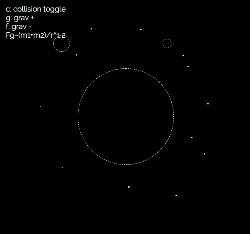

# javascript n-body simulator
A 2D gravity simulator in pure JavaScript



## Clone and Run

```sh
clone https://github.com/wyattfry/subclass-dance-party
```

Then open `index.html`

## Usage

The simulator starts with one mass in the center. To add masses, click and hold the cursor where you'd like the mass to appear. As you hold it down, the mass will gradually increase in mass (represented by radius). To give the mass an initial velocity, move the cursor in the opposite direction you'd like it to travel. The further you move the cursor, the more velocity it will have. When you are satisified with the direction and speed, release the mouse button.

### Controls

* `c` - toggle collision
* `g` - increase the strength of gravity
* `f` - decrease the strength of gravity
